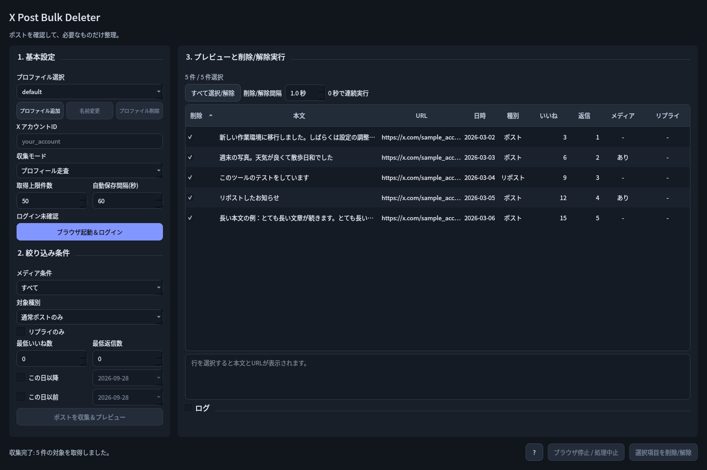

# kusamushiri（草むしり）🌱

X (Twitter) アカウントを手入れするデスクトップアプリです。

[English](README.md) | 日本語

自分の X アカウントのポストをまとめて削除・リポスト解除できます。
ブラウザ自動操作 (Playwright) と GUI (Qt / PySide6) で、条件に合うポストを **一覧で確認してから** 削除できます。



> [!WARNING]
> - **削除したポストは元に戻せません。** 実行前に一覧をよく確認してください。必要なら先に X の「データのアーカイブ」をダウンロードしておくことをおすすめします。
> - 本ツールは X Corp. とは無関係の非公式ツールです。ブラウザの自動操作は X の利用規約に抵触する可能性があり、アカウントが制限される場合があります。**自己責任でご利用ください。**
> - パスワードやログイン情報をツールが扱うことはありません。ログインは表示されたブラウザ上で手動で行い、ログイン状態はお使いの PC 内にのみ保存されます。

## 主な機能

- 期間・いいね数・返信数・メディア有無・リプライのみ・キーワード（含む/除外） などの条件でポストを絞り込み
- 通常ポストの削除とリポストの解除に対応
- いいねの取り消し: プロフィールのいいね欄から収集し、チェックしたポストのいいねを取り消し
- 実行前に一覧・本文プレビューで確認し、チェックした項目だけを実行
- チェックした項目を削除前の控えとして CSV / JSON に保存
- X の「データのアーカイブ」からポストを読み込み、検索で見つからない古いポストも対象に（このアプリで削除済みのポストは除外、古い順にも対応）
- 実行間隔の調整、途中停止、失敗分だけの再試行
- 複数アカウント（プロファイル）の切り替え
- フォローリストを CSV（Excel 対応）または JSON で書き出し
- フォロー中のアカウントを一覧で確認し（相互フォローは除外可能）、チェックしたものだけフォロー解除
- チェックしたフォロー中アカウントの最終ポスト日を取得し、取得日とともにプロファイルごとに記録・並べ替え

## インストール

### ビルド済みアプリ（おすすめ）

[Releases](https://github.com/kw4r3n/kusamushiri/releases) から OS に合ったファイルをダウンロードして展開します。

| OS | ファイル | 起動方法 |
|---|---|---|
| Windows | `kusamushiri-windows-x64.zip` | 展開した `kusamushiri` フォルダ内の `kusamushiri.exe` |
| macOS (Apple Silicon) | `kusamushiri-macos-arm64.zip` | `kusamushiri.app` |
| Linux | `kusamushiri-linux-x64.tar.gz` | 展開した `kusamushiri/kusamushiri` |

- 初回の「ブラウザ起動」時に Chromium（約 150MB）を自動でダウンロードします。
- アプリは署名されていないため、初回起動時に警告が出ることがあります。
  - Windows: SmartScreen で「詳細情報」→「実行」
  - macOS: `.app` を右クリック →「開く」。それでも開けない場合は `xattr -dr com.apple.quarantine kusamushiri.app`

### ソースから実行

[uv](https://docs.astral.sh/uv/) を使います（Python 3.11 は uv が自動で用意します）。

```bash
git clone https://github.com/kw4r3n/kusamushiri.git
cd kusamushiri
uv run kusamushiri
```

`start-kusamushiri.bat`（Windows）/ `start-kusamushiri.sh`（Linux/macOS）をダブルクリックしても起動できます。
pip の場合は `pip install .` のあと `kusamushiri` で起動します。

## 使い方

1. アプリを起動します。GUI が開いたら、必要な情報（対象のXアカウントID、絞り込み条件、対象種別など）を入力してください。
2. 「ブラウザ起動＆ログイン」ボタンを押し、表示されたブラウザ上で手動でXにログインしてください。
3. ログイン確認時に、現在ログイン中のアカウント名が取得できた場合は入力欄との差分を警告します。入力欄が空なら自動で補完されます。
4. 「ポストを収集＆プレビュー」を押すと、設定した条件に基づいて対象ポストが収集・一覧表示されます。
5. 「メディア条件」で「画像・動画なしのみ」を選ぶと、画像・動画を含まないポストだけを一覧化できます。
6. 「対象種別」で「リポストのみ」または「通常ポスト + リポスト」を選ぶと、リポストも一覧化できます。リポスト行を実行すると削除ではなくリポスト解除を行います。
7. 「投稿日」で「この日以降」「この日以前」を個別に指定できます。両方を有効にすると、指定期間内のポストだけを対象にできます。日付はどちらも指定日を含み、PC のタイムゾーン（日本なら JST）の日付で判定します。
8. 「含むキーワード」を指定すると、いずれかのキーワードを本文に含むポストだけを一覧化します。「除外キーワード」に一致するポストは一覧に入りません（残したいポストの保護に使えます）。複数指定はカンマ（`,` または `、`）区切りで、大文字/小文字と全角/半角の違いは区別しません。判定はタイムラインに表示された本文で行うため、「さらに表示」で折りたたまれた部分は対象外です。
9. 「削除/解除間隔」で各項目の実行間隔を秒単位で調整できます。`0 秒` にすると待機なしで連続実行します。
10. リストから実行したい項目にチェックを入れ（または全選択し）、「選択項目を削除/解除」ボタンを押して実行してください。
11. 一部の項目が失敗した場合は、詳細を確認したうえで失敗分だけ再試行できます。

## コマンドライン版（半自動化）

ダウンロードしたファイルには `kusamushiri-cli` も入っています（Windows: `kusamushiri-cli.exe`、macOS: `kusamushiri.app/Contents/MacOS/kusamushiri-cli`、ソースから: `uv run kusamushiri-cli`）。追加のインストールは不要です。

### かんたんな使い方: 一度質問に答えれば、あとは繰り返すだけ

`kusamushiri-cli` を引数なしで起動します（Windows では `kusamushiri-cli.exe` をダブルクリック）。プロファイル、条件（「30 日より前」「残したいキーワード」など）、削除まで行うかを質問形式で聞き、`kusamushiri.toml` に保存して次の流れで実行します。

1. 必要ならログイン（初回はブラウザのウィンドウが開きます）
2. 条件に合うポストを集め、一覧を `kusamushiri-lists/posts-<日時>.csv` に保存
3. 先頭数件を表示し、削除してよいか確認。答える前に CSV の行を消すと、その行は対象外になります（ファイルに残った行だけを実行）

次回は起動すると保存済みの設定を使うか聞かれます。`kusamushiri-cli run kusamushiri.toml` でも実行できます。設定ファイルはコメント付きのテキストなので、エディタで条件を変えられます。`[delete]` を書かなければ一覧の保存だけを行い、`[delete]` に `confirm = false` を書くと確認なしで実行します（定期実行向け）。

### 個別のコマンド

```bash
kusamushiri-cli login --profile main                 # 開いたブラウザで一度だけ手動ログイン
kusamushiri-cli collect --profile main --headless --older-than 30 --exclude 残す -o posts.json
kusamushiri-cli archive twitter-archive.zip --profile main --oldest-first -o old.json
kusamushiri-cli delete posts.json --profile main --headless --dry-run   # 対象の表示のみ
kusamushiri-cli delete posts.json --profile main --headless --interval 3 --failed-output failed.json
kusamushiri-cli following --profile main --skip-mutual -o follows.csv
kusamushiri-cli last-posts follows.csv --profile main -o follows.csv
kusamushiri-cli unfollow follows.csv --profile main --headless
```

- 一覧はアプリが書き出すのと同じ CSV / JSON で、プロファイルもアプリと共通です。
- `login` は常にウィンドウを表示します。ほかのコマンドは `--headless` でウィンドウなしで動き、未ログインなら中止します。ヘッドレスの Chromium は `HeadlessChrome` と名乗るため X に別扱いされることがあり、うまくいかない場合は `--headless` なしで試してください。
- `delete` と `unfollow` は実行前に確認します。無人で実行するときは `--yes` を付けてください。Ctrl+C で現在の項目の後に停止し、もう一度押すと即中断します。
- 終了コード: 0 成功、1 一部失敗、2 入力エラー、130 中断。各オプションは `kusamushiri-cli COMMAND --help` で確認できます。

## 開発

テスト・ビルド方法は [CONTRIBUTING.md](CONTRIBUTING.md) を参照してください。

## 補足

- GUI はダークテーマを標準で使用します。左側でプロファイル・条件を設定し、右側の一覧と本文プレビューで対象を確認できます。
- 設定欄は独立してスクロールでき、画面下の停止・削除操作は常に表示されます。選択件数は一覧上部に表示され、ログは必要なときに展開できます。処理中に停止すると、ブラウザの停止が完了するまで操作はロックされ、成功・失敗・未処理の件数がステータス欄に表示されます。
- 表示言語は日本語（標準）と英語から選べます。画面下の言語メニューで切り替え、アプリを再起動すると反映されます。
- デザインと画面例: [GUIデザイン](docs/design/gui-design.md)。
- 入力した条件と削除/解除間隔は次回起動時に復元されます。
- **複数アカウント対応**: GUI の「プロファイル追加」から名前を入力すると、新しい独立したブラウザプロファイルが作成・選択されます。追加後は「ブラウザ起動＆ログイン」でそのプロファイルに手動ログインしてください。既存のプロファイルは「プロファイル選択」から切り替えられ、ログイン状態と設定（フィルタ、取得上限など）は個別に保存されます。
- ブラウザ停止中は「名前変更」「プロファイル削除」を利用できます。削除するとそのプロファイルのログイン情報と設定が消えますが、Xのアカウントやポストは削除されません。`default` は名前変更・削除できません。
- ログイン確認後は、基本設定にログイン中のXアカウントを表示します。
- 削除処理は「…」ボタンと削除項目の描画を待ち、失敗した段階を表示します。「削除確定後の完了確認」で失敗した場合は結果不明のため、再試行前にX上で確認してください。自動で削除を繰り返すことはありません。
- 高度な検索は読み込み中に空と決めつけず、最大15秒待機します。一時的な投稿解析エラーは、スクロール前に最大3回試します。中止操作と収集の安全上限は維持します。
- ブラウザプロファイルはユーザー環境のデータディレクトリ（例: Windows は `%LOCALAPPDATA%\kusamushiri`、Linux は `~/.local/share/kusamushiri`）に保存されます。アカウントごとに `chromium-profile-{アカウント名}` という独立したプロファイルが作成されます。
- ログはユーザー環境のログディレクトリに保存されます。不具合報告の際に添付してください（個人のポスト内容が含まれる場合があるので確認のうえ共有してください）。

## 注意事項

- X の仕様変更（画面構成の変更）により、正常に動作しなくなる可能性があります。動かなくなった場合は Issue で報告してください。
- 短期間に大量のポストを削除すると、アカウントが制限される可能性があります。削除/解除間隔は余裕をもって設定してください。
- ブラウザ操作は自動で行われるため、実行中は表示されたブラウザを操作しないでください。

## ライセンス

[MIT](LICENSE)
